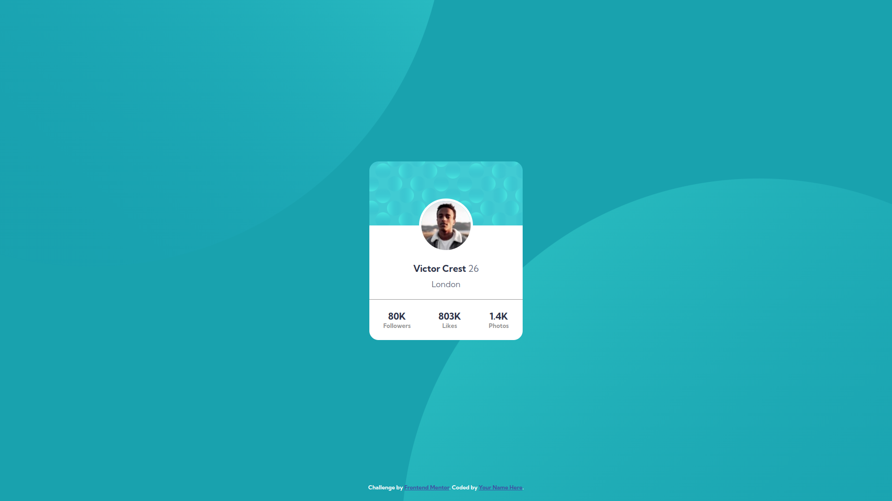
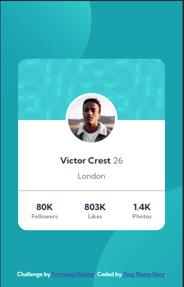

# Frontend Mentor - Profile card component solution

This is a solution to the [Profile card component challenge on Frontend Mentor](https://www.frontendmentor.io/challenges/profile-card-component-cfArpWshJ). Frontend Mentor challenges help you improve your coding skills by building realistic projects.

## Table of contents

- [Overview](#overview)
  - [The challenge](#the-challenge)
  - [Links](#links)
  - [Screenshot](#screenshot)
- [My process](#my-process)
  - [Built with](#built-with)
  - [What I learned](#what-i-learned)
- [Author](#author)

**Note: Delete this note and update the table of contents based on what sections you keep.**

## Overview

### The challenge

- Build out the project to the designs provided

### Links

- Solution URL: [Add solution URL here](https://your-solution-url.com)
- Live Site URL: [Add live site URL here](https://your-live-site-url.com)

### Screenshot

- **desktop**



- **mobile**



## My process

### Built with

- Semantic HTML5 markup
- CSS
- Flexbox

### What I learned

- How to use multiple backgrounds?

```css
body {
  background: url("../images/bg-pattern-top.svg"),
    url("../images/bg-pattern-bottom.svg"), var(--dark-cyan);
  background-size: 80vw, 80vw;
  background-repeat: no-repeat, no-repeat;
  background-position: -30vw -50vw, 45vw 20vw;
}
```

## Author

- Github - [keshavkumarhembram](https://github.com/keshavkumarhembram)
- Frontend Mentor - [@keshavkumarhembram](https://www.frontendmentor.io/profile/keshavkumarhembram)
- Twitter - [@keshavhembram](https://twitter.com/keshavhembram)
